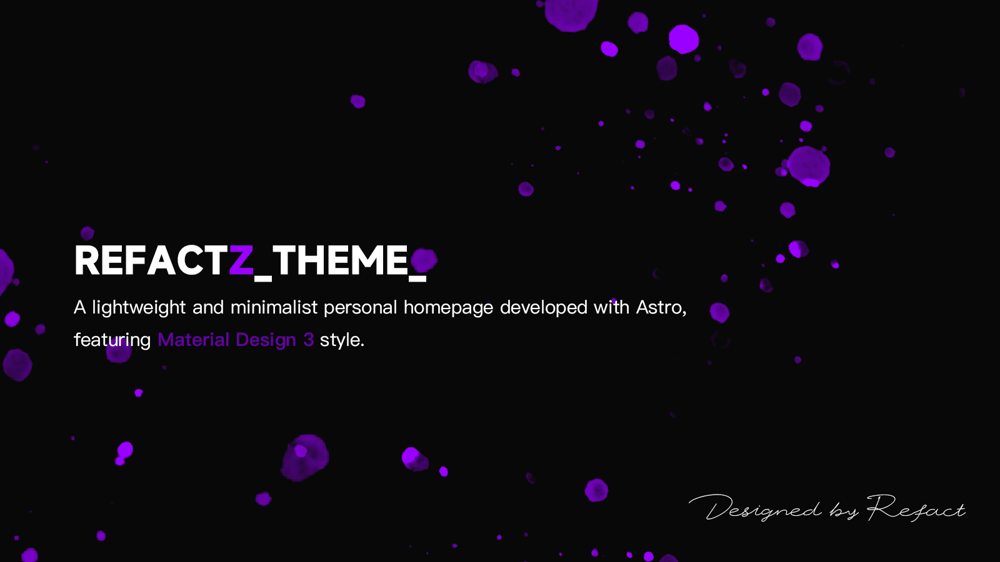

# RefactZ Theme / RefactZ 主题  

  

A lightweight and minimalist personal homepage developed with Astro, featuring Material Design 3 style.  
基于 Astro 开发的 Material Design 3 风格轻量简洁个人主页。

## Core Features / 核心功能  

### Responsive Design / 响应式设计  

- Fluid layout seamlessly adapts to various devices  
流畅的布局，无缝适配各类设备  

- Optimized reading experience across all screen sizes  
在所有屏幕尺寸上均提供优化的阅读体验  

### Dark Mode Support / 深色模式适配  

- Automatically adapts to system dark/light mode preferences  
自动适配系统深色/浅色模式偏好  

### Lightweight Design / 轻量化设计  

- Fast response and smooth interactions  
响应迅速，交互流畅  

- Easy to customize content and structure  
便于自定义内容与结构  

### Material Design 3 / Material Design 3 设计  

- All components sourced from @material/web library for consistent styling  
所有组件引用自 @material/web 组件库，风格统一规范  

## License / 许可证  

MIT License / MIT 许可证
